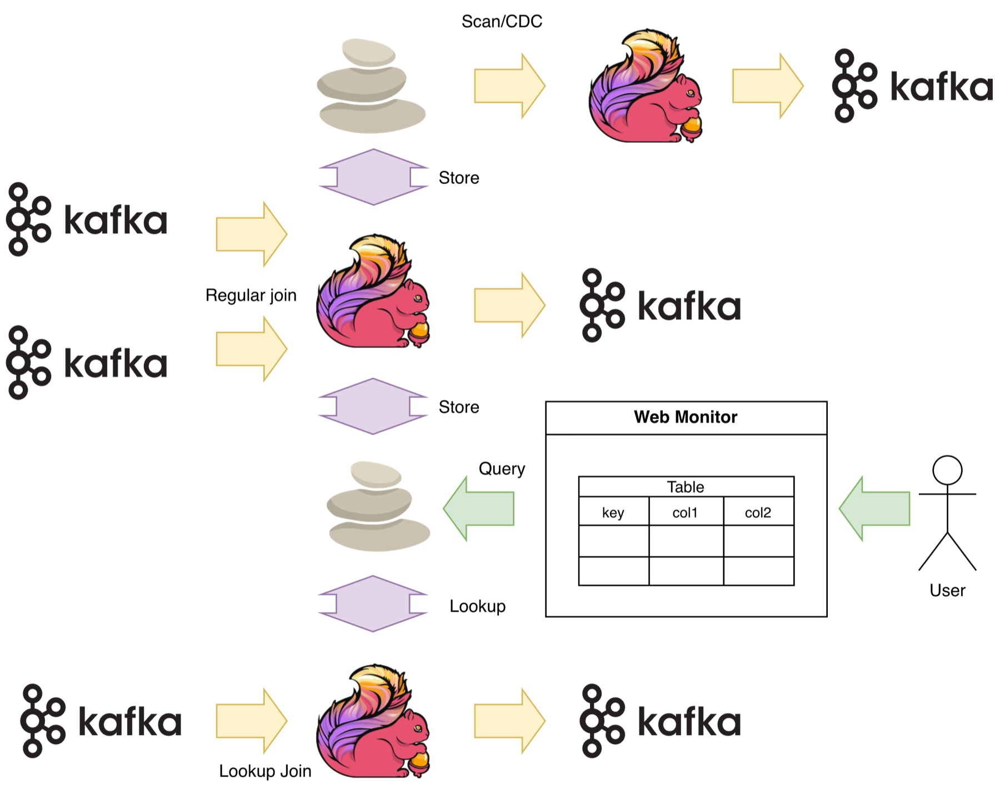

<p align="center"></p>
<p align="center">
  <a href="https://central.sonatype.com/artifact/io.github.cobble-project/cobble-flink-state"></a>
  <a href="https://github.com/cobble-project/cobble-flink/blob/main/LICENSE"></a>
  <a href="https://cobble-project.github.io/cobble-flink/latest/"></a>
  <a href="https://github.com/cobble-project/cobble-flink/actions/workflows/ci.yml"></a>
  <a href="https://cobble-project.github.io/cobble-flink/latest/getting-started/"></a>
</p>

Cobble-flink integrates [Cobble](https://github.com/cobble-project/cobble) with
[Apache Flink®](https://flink.apache.org/), so you can use Cobble as a Flink
state backend, SQL source, and SQL sink.

## Features

Cobble Flink currently provides:

- a **state backend** for stateful Flink jobs
- a **SQL source** for reading Cobble data in Flink SQL
- a **SQL sink** for writing Flink SQL results into Cobble
- a bundled **runtime jar** for Flink cluster deployment
- a **web monitor** for inspecting checkpoint and sink snapshots

For complete details, see the [documentation](https://cobble-project.github.io/cobble-flink/latest/).

## Why Cobble Flink

Flink state is essential to a stateful job, but it is often visible only to the
running job and restore tooling. Cobble Flink makes persisted state easier to
understand and reuse:

- **See what Flink stored.** The web monitor can browse checkpoints and sink
  snapshots by operator and state, then decode keys and values into semantic
  fields when schema information is available.
- **Consume state as data.** The SQL source can scan or look up Cobble sink
  tables and supported keyed state directly, including structured semantic
  columns. Persisted state is no longer useful only for job recovery.
- **Use one storage layer across workflows.** State backend, source, sink,
  metrics, and remote storage support work together, making it easier to debug
  a job, validate its state, and build new Flink pipelines from existing data.

This brings a different experience to stateful Flink: managed state remains
part of the runtime while becoming observable and consumable. The same applies
to tables written by the Cobble sink: users can inspect their snapshots and
read the data back through the Cobble source.

## Showcase

The diagram shows how Cobble connects Flink storage and consumption paths:

- Flink jobs can persist managed state or sink tables in Cobble while
  processing streams such as Kafka topics.
- Other Flink jobs can scan or continuously read the persisted data, or use it
  for exact-key lookup joins.
- The web monitor reads the same snapshots so users can inspect keys, values,
  and semantic columns without modifying the running job.

<p align="center"></p>

## Download and Versioning

You can get Cobble Flink artifacts from a Maven repository, or build them from
source if needed.

When choosing a version, make sure it matches both your Cobble version and your
Flink minor version.

The current release prefix is:

```text
0.2.3-1
```

Append the Flink compatibility suffix shown in the table below, for example:

```text
0.2.3-1-flink-1.17
```

Artifact versions vary when Flink breaks binary APIs. Use the matrix below to
choose the `<version>` value for each dependency in your `pom.xml` or for the
runtime jar you copy into Flink `lib/`:

| Flink cluster version | Dist bundle jar version | State dependency version | Sink dependency version | Source dependency version |
| --- | --- | --- | --- | --- |
| 1.17, 1.18 | `0.2.3-1-flink-1.17` | `0.2.3-1-flink-1.17` | `0.2.3-1-flink-1.17` | `0.2.3-1-flink-1.17` |
| 1.19, 1.20 | `0.2.3-1-flink-1.19` | `0.2.3-1-flink-1.19` | `0.2.3-1-flink-1.17` | `0.2.3-1-flink-1.17` |
| 2.0 | `0.2.3-1-flink-2.0` | `0.2.3-1-flink-2.0` | `0.2.3-1-flink-2.0` | `0.2.3-1-flink-1.17` |
| 2.1 and above | `0.2.3-1-flink-2.1` | `0.2.3-1-flink-2.1` | `0.2.3-1-flink-2.0` | `0.2.3-1-flink-1.17` |

ArtifactIds stay the same across Flink versions. Choose the artifactId from
the section you are using, then choose the `<version>` from the table.

## Setup

For most users, the simplest setup is to download the runtime jar and put it
into the Flink distribution.

Job-side Maven dependency is an alternative packaging choice. You usually do
not need both at the same time.

### Option A: use the runtime jar (recommended)

Download the runtime jar artifact that matches your Flink version and copy it
into Flink `lib/`. For example, on Flink 1.17 or 1.18:

```bash
cp cobble-flink-dist-0.2.3-1-flink-1.17.jar "$FLINK_HOME/lib/"
```

If you are developing from source instead of downloading from Maven, you can
build the distribution jar locally:

```bash
./mvnw -pl :cobble-flink-dist -am package -DskipTests
cp cobble-dist/target/cobble-flink-dist-*.jar "$FLINK_HOME/lib/"
```

For Flink 1.19 or 1.20, build `cobble-dist-flink-1.19`:

```bash
./mvnw -pl cobble-common,cobble-state-flink-1.19,cobble-sink,cobble-source,cobble-dist-flink-1.19 \
  package -DskipTests
cp cobble-dist-flink-1.19/target/cobble-flink-dist-*.jar "$FLINK_HOME/lib/"
```

For Flink 2.0, build `cobble-dist-flink-2.0`:

```bash
./mvnw -pl cobble-common,cobble-state-flink-2.0,cobble-sink-flink-2.0,cobble-source,cobble-dist-flink-2.0 \
  package -DskipTests
cp cobble-dist-flink-2.0/target/cobble-flink-dist-*.jar "$FLINK_HOME/lib/"
```

For Flink 2.1 and above, build `cobble-dist-flink-2.1`:

```bash
./mvnw -pl cobble-common,cobble-state-flink-2.1,cobble-sink-flink-2.0,cobble-source,cobble-dist-flink-2.1 \
  package -DskipTests
cp cobble-dist-flink-2.1/target/cobble-flink-dist-*.jar "$FLINK_HOME/lib/"
```

These artifacts can be built in the same reactor; no Maven profile switch is
required.

### Option B: use job-side Maven dependencies

When writing a Flink job, add the dependencies you actually use.

The following example is for a Flink 1.19 or 1.20 job that uses all three
parts. The state backend uses the 1.19-compatible artifact version, while sink
and source can use the 1.17-compatible artifact version:

```xml
<dependencies>
  <dependency>
    <groupId>io.github.cobble-project</groupId>
    <artifactId>cobble-flink-state</artifactId>
    <version>0.2.3-1-flink-1.19</version>
  </dependency>

  <dependency>
    <groupId>io.github.cobble-project</groupId>
    <artifactId>cobble-flink-source</artifactId>
    <version>0.2.3-1-flink-1.17</version>
  </dependency>

  <dependency>
    <groupId>io.github.cobble-project</groupId>
    <artifactId>cobble-flink-sink</artifactId>
    <version>0.2.3-1-flink-1.17</version>
  </dependency>
</dependencies>
```

Typical choices:

- stateful DataStream job: `cobble-flink-state`
- SQL read job: `cobble-flink-source`
- SQL write job: `cobble-flink-sink`

### Configure Flink and run your job

Make sure to configure Flink as described in the next section, then you can run your job as usual.
Cobble will automatically be used for state management and SQL source/sink based on your configuration.

## Web Monitor

`cobble-flink-monitor` starts a read-only web UI for inspecting Cobble data in
Flink checkpoints or normal Cobble sink/table snapshots. It can list available
checkpoints/snapshots, select `latest` or a concrete snapshot, choose operators
for checkpoint sources, scan key/value rows, and track selected rows. For
Cobble state backend checkpoints, it can display schema-aware state and timer
parts such as state key, map key, list elements, timer timestamp, timer key, and
decoded values when metadata is available.

Build it with:

```bash
./mvnw -pl cobble-flink-monitor -am package -DskipTests
```

Start it with an optional initial source:

```bash
java -jar cobble-flink-monitor/target/cobble-flink-monitor-*.jar \
  --checkpoint s3://bucket/path/to/checkpoints \
  --flink-conf "$FLINK_HOME/conf" \
  --port 18088
```

If `--checkpoint` is omitted, open the UI first and use the `Datasource` page to
enter a checkpoint root, a concrete `chk-*` directory, or a Cobble sink/table
path. `--flink-conf` is optional and is useful when checkpoint data lives on a
remote filesystem configured through Flink.

## Get Started

### Flink's State Backend

For stateful jobs, Cobble can be used as the Flink state backend. Add the following to the
[Flink cluster configuration file](https://cobble-project.github.io/cobble-flink/latest/getting-started/#flink-cluster-configuration) for your
version:

```yaml
state.backend.type: io.cobble.flink.state.CobbleStateBackendFactory
# Recommended, optional: materialize checkpoint sidecars for faster monitor/source reads.
high-availability.type: io.cobble.flink.state.CobbleHighAvailabilityServicesFactory
```

The Cobble HA wrapper is recommended, but not required. It materializes and maintains Cobble
checkpoint sidecars early, which makes monitor and source discovery faster. Without it, the
monitor and state source can rebuild a read-only view from Flink `_metadata` when needed.

If you use the wrapper and already have another HA mode, move that value to
`cobble.ha.delegate.type`.

Example:

```yaml
state.backend.type: io.cobble.flink.state.CobbleStateBackendFactory
# Recommended, optional: materialize checkpoint sidecars for faster monitor/source reads.
high-availability.type: io.cobble.flink.state.CobbleHighAvailabilityServicesFactory
cobble.ha.delegate.type: kubernetes
```

Cobble restore and rescale currently support only Flink `CLAIM` restore mode.
`NO_CLAIM` and `LEGACY` are not supported.

Cobble can also restore a job from a **RocksDB canonical savepoint**, which is
the recommended way to migrate an existing RocksDB-backed job onto Cobble. Take
the savepoint with `flink savepoint --type canonical`, then start the job with
`-restoreMode CLAIM`. See the
[state backend docs](https://cobble-project.github.io/cobble-flink/latest/state-backend/#restore-from-a-rocksdb-canonical-savepoint)
for the full guide.

### Flink's Sink

For SQL writes, use:

- `connector='cobble'`
- `path`
- `bucket`
- `sink.parallelism`

Example:

```sql
CREATE TABLE sink_tbl (
  k BIGINT,
  v BIGINT,
  PRIMARY KEY (k) NOT ENFORCED
) WITH (
  'connector' = 'cobble',
  'path' = 'hdfs:///tmp/cobble-table',
  'bucket' = '16',
  'sink.parallelism' = '4'
);
```

### Flink's Source

Cobble source lets Flink SQL read data that is already stored in Cobble. There
are three source kinds:

- `source.kind='sink'` reads a Cobble table written by the Cobble SQL sink.
- `source.kind='state'` reads keyed state from a Flink checkpoint written by the
  Cobble state backend.
- `source.kind='raw'` reads any standard Cobble table root as raw bytes, without
  depending on sink or state schema. Useful for debugging and interoperability.

Use `source.kind='auto'` when the path layout is unambiguous, or set the kind
explicitly in production DDL. `auto` never selects `raw`; it must be set
explicitly.

For reading a Cobble sink table, use:

- `connector='cobble'`
- `path`
- `source.kind='sink'`
- `scan.checkpoint-id`
- `scan.mode`

Sink tables require a primary key and can also be used in temporal lookup joins:

```sql
CREATE TABLE source_tbl (
  phase STRING,
  id BIGINT,
  v BIGINT,
  PRIMARY KEY (phase, id) NOT ENFORCED
) WITH (
  'connector' = 'cobble',
  'source.kind' = 'sink',
  'path' = 'hdfs:///tmp/cobble-table',
  'scan.checkpoint-id' = 'latest',
  'scan.mode' = 'batch'
);
```

Lookup join example:

```sql
SELECT o.order_id, o.id, d.name, d.score
FROM orders AS o
LEFT JOIN source_tbl FOR SYSTEM_TIME AS OF o.pt AS d
ON o.id = d.id;
```

For reading Cobble state backend checkpoints, use:

- `connector='cobble'`
- `path` pointing at the checkpoint root or a concrete `chk-*` directory
- `source.kind='state'`
- `state.name`
- `state.operator-id` when the checkpoint has more than one Cobble operator
- `state.kind` when you want an explicit validation hint
- `scan.checkpoint-id`
- `scan.mode`

State scan does not require a primary key. State lookup joins require a primary
key that contains the full exact lookup key. For `ValueState`, `ReducingState`,
and `AggregatingState`, that means the state key plus namespace when present.
For `MapState`, it means state key, namespace when present, and map key.

When the Cobble data was produced by Flink SQL, Cobble records schema metadata
so the source can expose semantic columns instead of raw key/value bytes. For
example, a SQL join state can be read with columns such as `customer_id`,
`order_id`, and `amount`, and a Cobble sink table can be read with its original
primary-key and value columns. See [Source](https://cobble-project.github.io/cobble-flink/latest/source/) for the full DDL
patterns.

```sql
CREATE TABLE state_values (
  `key` INT,
  `value` INT,
  PRIMARY KEY (`key`) NOT ENFORCED
) WITH (
  'connector' = 'cobble',
  'source.kind' = 'state',
  'path' = 'hdfs:///tmp/flink-checkpoints',
  'state.operator-id' = '<operator-id>',
  'state.name' = 'value-state',
  'state.kind' = 'value',
  'scan.checkpoint-id' = 'latest',
  'scan.mode' = 'batch'
);

SELECT p.`key`, d.`value`
FROM probes AS p
LEFT JOIN state_values FOR SYSTEM_TIME AS OF p.pt AS d
ON p.`key` = d.`key`;
```

For reading any Cobble table root as raw bytes (no sink or state schema), use:

- `connector='cobble'`
- `path`
- `source.kind='raw'`
- `raw.columns` (required, e.g. `'0,1'`)
- `scan.checkpoint-id`
- `scan.mode`

The raw source requires a fixed two-column DDL: `key BYTES` and `columns
ARRAY<BYTES>`. It emits the raw Cobble row key and the selected structured value
columns as raw bytes, preserving nulls and arbitrary binary content. Lookup is
not supported.

```sql
CREATE TABLE raw_cobble (
  `key` BYTES,
  `columns` ARRAY<BYTES>
) WITH (
  'connector' = 'cobble',
  'source.kind' = 'raw',
  'path' = 'hdfs:///tmp/cobble-table',
  'raw.columns' = '0,1',
  'scan.checkpoint-id' = 'latest',
  'scan.mode' = 'batch'
);

SELECT `key`, `columns` FROM raw_cobble;
```

## License

This project is licensed under the Apache-2.0 License. See the [LICENSE](LICENSE) file for details.

## Notice

The [Apache Flink®](https://flink.apache.org/) is registered trademarks of The Apache Software Foundation in the United States and other countries.
