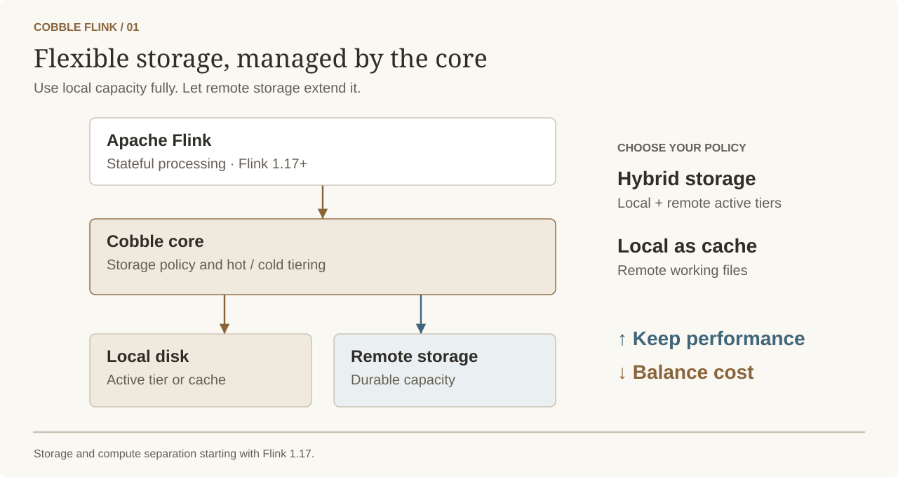
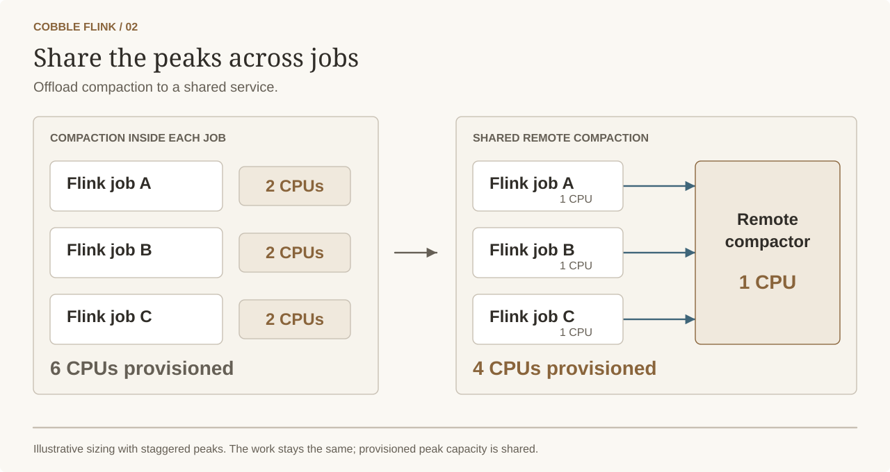
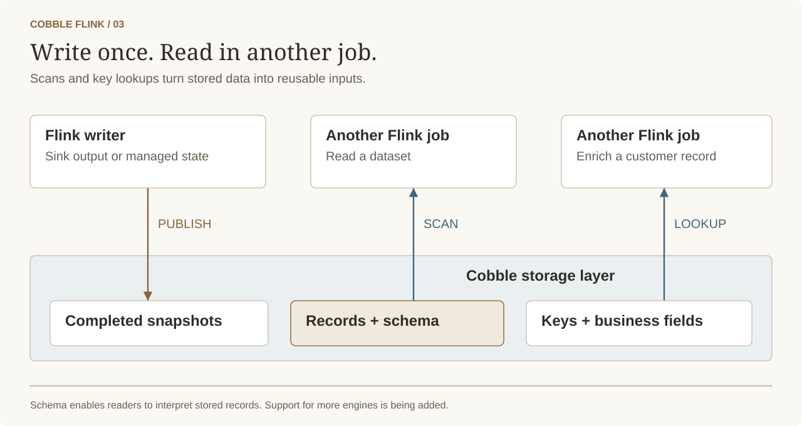
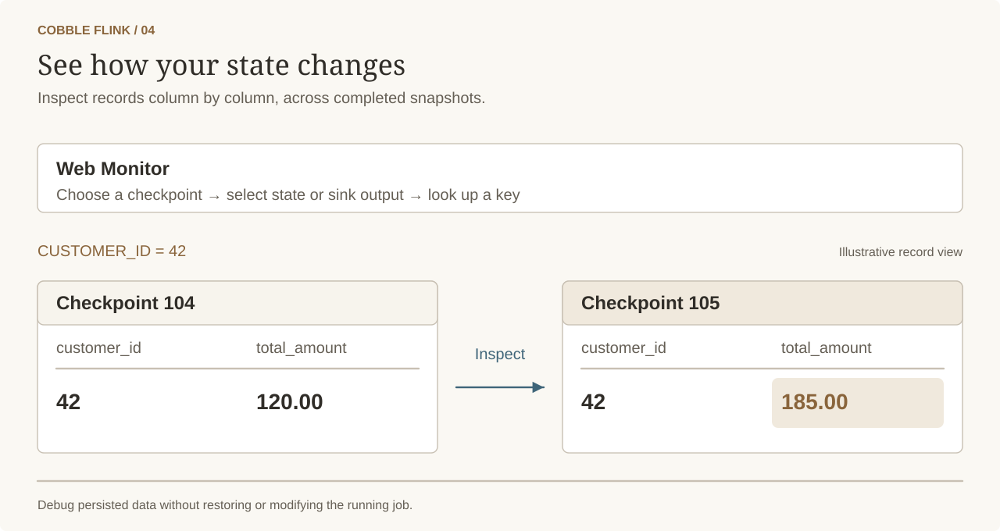

  
  
  
  
  

**Cobble Flink** is unified storage for Apache Flink: write processing results,
read stored data, and manage streaming state through the same
[Cobble core](https://github.com/cobble-project/cobble).

https://github.com/user-attachments/assets/5b9406ff-4d18-4247-899d-6d10d8685c70

*Cobble Flink: flexible storage, reusable data, and visible state.*

[Documentation](https://cobble-project.github.io/cobble-flink/latest/)
· [Getting started](https://cobble-project.github.io/cobble-flink/latest/getting-started/)

## Use Cases

### Balance storage cost and state performance

Separate storage from compute, starting with Flink 1.17. Choose hybrid storage
or local caching to balance capacity, cost, and performance.

  

[Explore the state backend](https://cobble-project.github.io/cobble-flink/latest/state-backend/)
· [See benchmarks](https://cobble-project.github.io/cobble-flink/latest/state-backend/benchmark)

### Share compaction capacity across jobs

Offload compaction from processing jobs and share CPU capacity across their peaks.

  

[Configure remote compaction](https://cobble-project.github.io/cobble-flink/latest/state-backend/#remote-compaction)

### Write once, reuse across jobs

Let another job scan stored results or look up a key for enrichment. Supported
keyed state is reusable too.

  

[Write with the sink](https://cobble-project.github.io/cobble-flink/latest/sink/)
· [Scan and look up data](https://cobble-project.github.io/cobble-flink/latest/source/)

### See what changed in your state

Look up state and sink records, inspect business fields, and track changes
across snapshots to debug your job.

  

[Explore the Web Monitor](https://cobble-project.github.io/cobble-flink/latest/web-monitor/)

## Getting Started

Follow the [Getting Started guide](https://cobble-project.github.io/cobble-flink/latest/getting-started/)
for version selection, installation, state-backend configuration, and
SQL examples for writes, scans, and lookup joins.

## License

This project is licensed under the Apache-2.0 License. See the [LICENSE](LICENSE) file for details.

## Notice

The [Apache Flink®](https://flink.apache.org/) is registered trademarks of The Apache Software Foundation in the United States and other countries.
