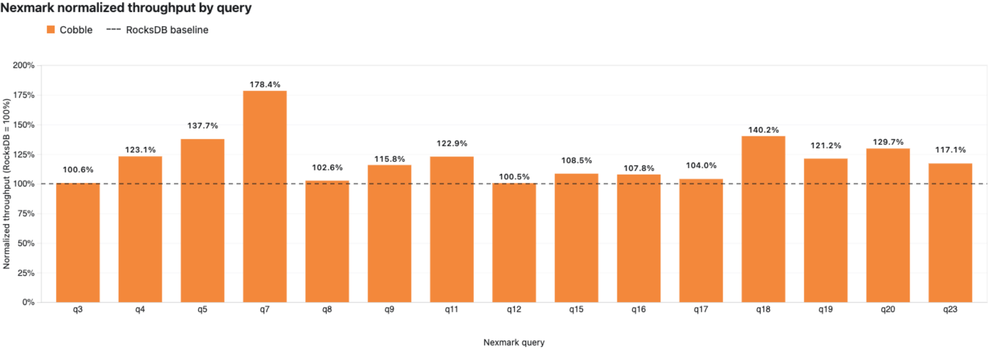
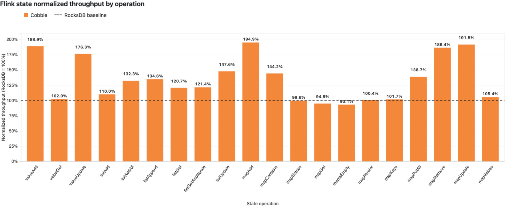

# Benchmark

This page compares Cobble and RocksDB as Flink state backends using Nexmark for
end-to-end streaming throughput, the Flink state micro-benchmark for isolated
state operations, and a remote checkpoint rescale benchmark.

All results were produced from a single local machine (Apple Silicon, macOS,
32 GiB RAM, 10 cores) with the same Cobble and RocksDB configuration on both
sides. The comparison is directional; absolute numbers depend on hardware and
workload.

## Test setup

| Item | Value |
|---|---|
| Cobble version | 0.4.0-1-flink-1.17 |
| Flink | 1.17.2 |
| Java | OpenJDK 11.0.29 |

Both backends use Flink managed memory exclusively (no fixed-per-slot memory),
so each backend receives the same memory budget in every comparison. No
profiling, tuning, or diagnostic options were enabled during the runs. The
Nexmark and state micro-benchmark suites were each run in isolation with no
other workload on the machine.

## Nexmark streaming benchmark

[Nexmark](https://github.com/nexmark/nexmark) is a streaming benchmark that
generates a synthetic stream of auction events (persons, auctions, bids) and
runs SQL queries against it. We use it to measure end-to-end pipeline
throughput under realistic stateful workloads.

### Configuration

| Item | Value |
|---|---|
| Events per run | 15,000,000 |
| Source rate ceiling | 10,000,000 events/s |
| Parallelism | 1 |
| TaskManager slots | 1 |
| Checkpointing | disabled |
| Sink | Nexmark blackhole |
| JobManager / TaskManager memory | 8 GiB each |
| State TTL | 24 h (both backends, `table.exec.state.ttl`) |
| Generator seed | fixed per round (1001, 2002, 3003) |
| Base event time | fixed (`2024-01-01 00:00:00 UTC`) |
| Rounds | 3 (one per seed, results averaged) |
| Queries | q3, q4, q5, q7, q8, q9, q11, q12, q15, q16, q17, q18, q19, q20, q23 |

To make the comparison reproducible, the Nexmark source was patched to
accept a fixed `generator.seed` and `base.time`. Each round runs with a
different fixed seed (1001, 2002, 3003) so the three rounds exercise
distinct event streams, while every run of the same seed produces byte-
identical data. A 24 h state TTL (`table.exec.state.ttl`) is applied
identically to both backends; Cobble honors it natively via per-write
expiry. Each query/backend pair was run once per seed; the table below
reports the average duration across the three seeds.

### Results

The "Cobble throughput" column is `(RocksDB duration / Cobble duration - 1) * 100%`;
a positive value means Cobble finished faster.

| Query | RocksDB duration | Cobble duration | Cobble throughput |
|---|---:|---:|---:|
| q3 | 28.0s | 27.9s | +0.6% |
| q4 | 123.1s | 100.0s | +23.1% |
| q5 | 95.8s | 69.6s | +37.7% |
| q7 | 176.9s | 99.2s | +78.4% |
| q8 | 28.6s | 27.9s | +2.6% |
| q9 | 225.9s | 195.2s | +15.8% |
| q11 | 104.2s | 84.8s | +22.9% |
| q12 | 30.7s | 30.6s | +0.5% |
| q15 | 91.2s | 84.1s | +8.5% |
| q16 | 307.8s | 285.6s | +7.8% |
| q17 | 48.7s | 46.8s | +4.0% |
| q18 | 72.8s | 51.9s | +40.2% |
| q19 | 63.7s | 52.5s | +21.2% |
| q20 | 159.2s | 122.7s | +29.7% |
| q23 | 290.4s | 247.9s | +17.1% |
| **Total** | **1847.1s** | **1526.7s** | **+21.0%** |

### Summary

- Cobble is faster by more than 5% in **11 of 15** queries and within 5% in
  the other 4.
- The total Cobble duration is **17.3% lower** than RocksDB
  (1526.7s vs 1847.1s), a **+21.0%** throughput advantage.
- The largest Cobble lead is on **q7** (+78.4%), a stateful join with heavy
  state access.
- q15 is 8.5% faster with Cobble; q3, q8, q12, and q17 are within 5%.

## Flink state micro-benchmark

The `cobble-state-bench` module is a JMH in-process benchmark that measures
individual state operation throughput (ValueState, ListState, MapState) in
isolation, without a running Flink cluster. It is the Flink community's state
benchmark adapted to compare Cobble and RocksDB directly.

### Configuration

| Item | Value |
|---|---|
| JMH mode | Throughput |
| Unit | operations/ms |
| Threads | 1 |
| Warmup | 10 iterations, 1 second each |
| Measurement | 10 iterations, 1 second each |
| Forks | 3 |
| Backends | RocksDB, Cobble |
| Managed memory | 256 MiB (both backends, fraction 1.0) |
| Fixed-per-slot memory | none |
| JVM heap | not set |

Both backends explicitly enable managed memory and receive the full 256 MiB
budget. Neither backend uses fixed-per-slot memory or per-run tuning. The
score error is JMH's 99.9% confidence interval across 3 forks (30 measurement
samples per result).

### Results

The "Cobble throughput" column is `(Cobble score / RocksDB score - 1) * 100%`;
a positive value means Cobble has higher throughput.

| Benchmark | RocksDB | Cobble | Cobble throughput |
|---|---:|---:|---:|
| valueAdd | 628.324 ± 39.355 | 1186.824 ± 15.843 | +88.9% |
| valueGet | 983.301 ± 10.914 | 1003.100 ± 12.059 | +2.0% |
| valueUpdate | 640.803 ± 38.806 | 1129.497 ± 24.800 | +76.3% |
| listAdd | 782.201 ± 18.100 | 860.401 ± 9.411 | +10.0% |
| listAddAll | 499.097 ± 5.215 | 660.119 ± 10.134 | +32.3% |
| listAppend | 757.518 ± 19.712 | 1019.736 ± 28.377 | +34.6% |
| listGet | 750.388 ± 7.174 | 905.950 ± 9.075 | +20.7% |
| listGetAndIterate | 741.915 ± 9.018 | 900.436 ± 12.795 | +21.4% |
| listUpdate | 785.069 ± 16.797 | 1158.398 ± 21.968 | +47.6% |
| mapAdd | 604.981 ± 45.372 | 1179.077 ± 10.891 | +94.9% |
| mapContains | 384.808 ± 5.395 | 555.001 ± 6.454 | +44.2% |
| mapEntries | 994.319 ± 30.562 | 989.964 ± 7.669 | -0.4% |
| mapGet | 439.575 ± 5.572 | 416.688 ± 5.020 | -5.2% |
| mapIsEmpty | 266.524 ± 19.989 | 248.163 ± 6.060 | -6.9% |
| mapIterator | 994.958 ± 31.906 | 998.529 ± 5.513 | +0.4% |
| mapKeys | 1011.880 ± 34.143 | 1029.464 ± 7.259 | +1.7% |
| mapPutAll | 118.335 ± 4.841 | 164.087 ± 5.014 | +38.7% |
| mapRemove | 702.122 ± 58.241 | 1308.669 ± 22.999 | +86.4% |
| mapUpdate | 611.308 ± 44.671 | 1170.361 ± 13.765 | +91.5% |
| mapValues | 997.387 ± 33.343 | 1051.495 ± 7.126 | +5.4% |

### Summary

- Cobble has higher throughput in **14 of 20** benchmarks (above 5%), is within
  5% in 4 benchmarks, and is slower in **2** benchmarks (mapGet, mapIsEmpty).
- The largest Cobble leads are on **mapAdd** (+94.9%), **mapUpdate** (+91.5%),
  and **mapRemove** (+86.4%).
- **5 of 20** benchmarks have overlapping 99.9% confidence intervals; in all
  of these the difference is within ±7%.

## Remote rescale benchmark

This benchmark measures Flink-native checkpoint rescaling against an
S3-compatible object store with added network latency. An unbounded WordCount
job initializes a fixed 4 GiB keyspace and then updates it without a source
rate limit. The keyspace is unchanged by parallelism.

### Configuration

| Item | Value |
|---|---|
| Cobble version | 0.3.0-1-flink-1.17 (validated at 0.4.0-1) |
| Flink | 1.17.2 |
| State | 524,288 keys, 8 KiB payload per key (4 GiB configured) |
| Object store | RustFS through Toxiproxy |
| Added object-store latency | 40 ± 5 ms in each direction |
| Aggregate restore bandwidth | 1,000 Mbit/s across all connections |
| Restore mode | native checkpoint, claim |
| Parallelism | 2 to 3, then 3 to 2 |
| Resources per subtask | 1 slot, 1 CPU, 512 MiB managed memory |
| TaskManager process memory | 2 GiB per subtask |
| Source rate limit | none |
| Execution order | RocksDB and Cobble run sequentially |

Parallelism 2 uses two one-slot TaskManagers; parallelism 3 uses three. The
total resources therefore scale in the same 2:3 ratio as the job.

Restore time is measured from submission until every job subtask reports
`RUNNING` through the Flink REST lifecycle API. A job-level `RUNNING` state is
not sufficient while any subtask remains `INITIALIZING`. The aggregate
bandwidth limit is enabled immediately before each restore submission and
removed after all subtasks reach `RUNNING`.

### Results

| Backend | 2 to 3 restore | 3 to 2 restore |
|---|---:|---:|
| RocksDB | 75.214s | 84.392s |
| Cobble | 11.172s | 10.960s |

Cobble reached `RUNNING` 6.73 times faster for scale-out and 7.70 times faster
for scale-in. The traffic shaper recorded the following aggregate bytes sent
by the object-store proxy while each restore was bandwidth-limited:

| Backend | 2 to 3 proxy bytes | 3 to 2 proxy bytes |
|---|---:|---:|
| RocksDB | 8.71 GB | 9.72 GB |
| Cobble | 0.96 GB | 0.94 GB |

Each traffic-shaper record reported a `1 Gbit` rate and nonzero traffic.
Cobble restored rescaled state files by reference instead of downloading the
complete state before startup.

The first 30-second throughput sample did not advance for either backend, so it
is excluded rather than treated as a zero-throughput result. Later windows show
that both jobs resumed processing:

| Backend | 2 to 3, 30-60s | 2 to 3, 120-180s | 3 to 2, 30-60s | 3 to 2, 120-180s |
|---|---:|---:|---:|---:|
| RocksDB | 1,275,678 events/s | 1,276,797 events/s | 830,462 events/s | 828,329 events/s |
| Cobble | 1,266,066 events/s | 1,666,907 events/s | 977,647 events/s | 1,129,954 events/s |

## Observations

The Nexmark and state micro-benchmark results show Cobble delivering higher
throughput than RocksDB under the same managed-memory budget:

- **Write-heavy operations** (valueAdd, valueUpdate, mapAdd, mapUpdate,
  mapRemove) show the largest Cobble advantages in the micro-benchmark, and
  the stateful Nexmark queries (q4, q5, q7, q18, q20) show the largest
  end-to-end gains.
- **Read-only or full-scan operations** (valueGet, mapGet, mapEntries,
  mapIterator, mapKeys, mapValues) are roughly equal, with Cobble slightly
  ahead and overlapping confidence intervals.
- Cobble's default memtable type is now `adaptive`: the native engine monitors
  read/write/scan patterns and switches the memtable type at runtime (Vec for
  write-heavy, Hash for point-read-heavy, Skiplist for mixed workloads). This
  is why write-oriented state operations see larger gains than in 0.3.0.
- All Nexmark queries show a Cobble gain; q3, q8, q12, and q17 are within 5%.
- The remote rescale benchmark shows a separate tradeoff: restoring shared
  files by reference substantially reduces time to `RUNNING`, while a cold
  random-read workload can remain limited by remote-storage latency until its
  working set is cached or materialized locally.

These results reflect the current default configuration of both backends
without tuning. Production performance depends on workload characteristics,
state size, hardware, and Flink configuration.
