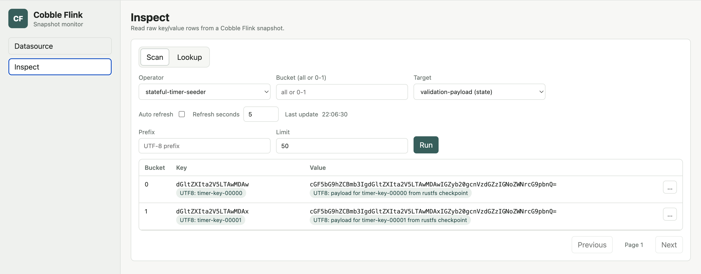

# Web Monitor

Use the Cobble Flink web monitor when you want to inspect Cobble data that was
produced by a Flink checkpoint or by a Cobble sink.

The monitor is read-only. It starts a small Java HTTP server, opens a browser UI,
and lets you choose a datasource, snapshot, and inspect mode without writing a
separate Flink job.

## When To Use It

The web monitor is useful when you want to answer questions such as:

- whether a checkpoint contains Cobble state for a specific operator
- what state names are available inside a checkpoint
- whether a sink path has committed snapshots
- what keys and values are present in a selected bucket or prefix
- whether a small set of keys keeps changing as newer snapshots appear

It is intended for inspection and debugging. For normal production reads, use
the Cobble source connector or your own application code.

## Build and Run

Build the web monitor from the repository:

```bash
./mvnw -pl cobble-flink-monitor -am package -DskipTests
```

Start it with no initial datasource:

```bash
java -jar cobble-flink-monitor/target/cobble-flink-monitor-*.jar
```

Then open the UI and choose a path from the `Datasource` page.

You can also provide an initial path:

```bash
java -jar cobble-flink-monitor/target/cobble-flink-monitor-*.jar \
  --checkpoint file:///path/to/checkpoints-or-cobble-table
```

The `--checkpoint` option accepts either a Flink checkpoint root or a normal
Cobble datasource path. For a Flink checkpoint, you can point to the checkpoint
root or directly to a concrete `chk-*` directory:

```bash
java -jar cobble-flink-monitor/target/cobble-flink-monitor-*.jar \
  --checkpoint file:///path/to/checkpoints/chk-42
```

Useful options:

```text
--bind 127.0.0.1
--port 8088
--checkpoint file:///path/to/checkpoints-or-cobble-table
--flink-conf /path/to/flink/conf
--total-buckets 32768
--inspect-default-limit 100
--inspect-max-limit 1000
```

## Remote Storage

If the datasource is on a remote filesystem, pass `--flink-conf` so the monitor
can load the same filesystem configuration used by Flink:

```bash
java -jar cobble-flink-monitor/target/cobble-flink-monitor-*.jar \
  --flink-conf "$FLINK_HOME/conf" \
  --checkpoint s3://bucket/path/to/checkpoints
```

This is the recommended way to inspect paths on S3-compatible storage, OSS,
Azure, GCS, HDFS, or other Flink-supported filesystems. The web monitor
initializes Flink filesystems before opening the datasource and passes the
relevant storage options to Cobble when reading remote volumes.

For S3-compatible storage, the Flink configuration usually includes settings
such as:

```yaml
s3.endpoint: https://s3.example.com
s3.access-key: your-access-key
s3.secret-key: your-secret-key
s3.path.style.access: true
s3.region: us-east-1
```

## Datasource Selection

The `Datasource` page lists snapshots available under the current path.

For a Flink checkpoint root, the monitor scans checkpoint directories such as
`chk-42`, discovers Cobble operators, and lets you choose:

- `latest`, which follows the newest checkpoint after refresh
- a concrete checkpoint
- an operator, on the `Inspect` page

For a normal Cobble datasource such as a sink path, the monitor scans
`snapshot/SNAPSHOT-*` and lets you choose:

- `latest`, which follows the newest Cobble snapshot after refresh
- a concrete snapshot

Operator selection is only shown for checkpoint datasources. Sink and ordinary
Cobble datasource paths expose a single `sink` inspect target.


## Inspect Data

The `Inspect` page has two modes.

### Scan Mode

Use scan mode when you want to browse keys in one bucket or across all buckets.
You can set:

- bucket, or `all`
- key prefix
- row limit
- columns, for sink datasources

State data exposes state names directly. It does not expose column families in
the UI. Sink data exposes columns because sink rows are stored as multi-column
records.

When bytes can be decoded as UTF-8, the UI shows a `UTF8:` label next to the
base64 representation. If bytes are not valid UTF-8, only the base64 value is
shown.



### Lookup Mode

Use lookup mode when you want to keep watching specific keys. From scan results,
choose `Track in lookup` from a row action menu. The lookup view can track
multiple entries and refresh them together.

Lookup mode is useful when the datasource is `latest` and you want to compare
the same keys across newer snapshots.

## Notes

- The monitor is read-only.
- `latest` is resolved from the current datasource list and can be refreshed.
- Checkpoint datasources support operator discovery.
- Sink datasources support column projection.
