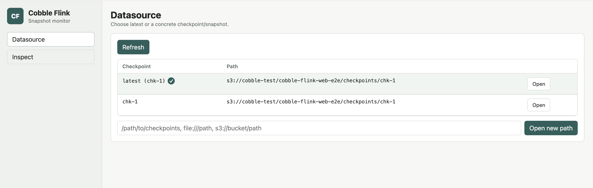

# Web Monitor

Use the Cobble Flink web monitor to inspect Cobble data from a browser. It can
open Flink checkpoint paths written by the Cobble state backend, and it can also
open normal Cobble datasource paths such as sink output.

The monitor is read-only. It runs as a small Java process, serves the UI and API
from the same port, and does not require a Flink job to read the selected
snapshot.

## When To Use It

The web monitor is useful when you want to:

- check which checkpoints or Cobble snapshots are available
- follow `latest` while a job is still producing checkpoints
- keep a small set of rows tracked while newer snapshots appear
- inspect Cobble state by state name, verify decoded state keys, MapState keys, ListState values, and timer entries
- inspect Cobble sink rows and selected columns

For production reads, use the Cobble source connector or your own application
code. The monitor is meant for debugging, validation, and ad-hoc inspection.

## Build

Build the monitor from the repository:

```bash
./mvnw -pl cobble-flink-monitor -am package -DskipTests
```

The runnable jar is written under `cobble-flink-monitor/target/`.

## Start The Monitor

Start without an initial datasource:

```bash
java -jar cobble-flink-monitor/target/cobble-flink-monitor-*.jar
```

Then open the UI and use the `Datasource` page to enter a checkpoint root,
concrete `chk-*` directory, or Cobble datasource path.

You can also pass an initial path:

```bash
java -jar cobble-flink-monitor/target/cobble-flink-monitor-*.jar \
  --checkpoint file:///path/to/checkpoints-or-cobble-table
```

For Flink checkpoints, both of these are valid:

```bash
java -jar cobble-flink-monitor/target/cobble-flink-monitor-*.jar \
  --checkpoint s3:///path/to/checkpoints

java -jar cobble-flink-monitor/target/cobble-flink-monitor-*.jar \
  --checkpoint s3:///path/to/checkpoints/chk-42
```

Useful options:

```text
--bind 127.0.0.1
--port 8088
--checkpoint file:///path/to/checkpoints-or-cobble-table
--flink-conf /path/to/flink/conf
--total-buckets 32768
--inspect-default-limit 100
--inspect-max-limit 1000
```

## Remote Filesystems

Pass `--flink-conf` when the datasource is on a filesystem configured through
Flink:

```bash
java -jar cobble-flink-monitor/target/cobble-flink-monitor-*.jar \
  --flink-conf "$FLINK_HOME/conf" \
  --checkpoint s3://bucket/path/to/checkpoints
```

The monitor initializes Flink filesystems before it scans the datasource and
passes the relevant storage configuration to Cobble readers. Use this for S3,
OSS, Azure, GCS, HDFS, and compatible filesystems.

## Datasource Page

The `Datasource` page shows the snapshots available under the current path.

For a Flink checkpoint root, the monitor scans `chk-*` directories, discovers
Cobble operators, and lets you choose:

- `latest`, which follows the newest readable checkpoint
- a concrete checkpoint
- an operator, shown on the `Inspect` page for checkpoint datasources

For a normal Cobble datasource, the monitor scans `snapshot/SNAPSHOT-*` and
lets you choose:

- `latest`, which follows the newest Cobble snapshot
- a concrete snapshot

Use `Refresh` to rescan the path. If old checkpoints have been removed, they
are removed from the list on refresh.



## Inspect Page

The `Inspect` page has two modes: `Scan` and `Track`.

### Scan

Use `Scan` when you want to browse rows.

For sink datasources, set a bucket, key prefix, row limit, and optional column
projection.

For state datasources with schema metadata, the target list shows state names.
The UI hides column families and displays decoded parts when possible:

#### ValueState

ValueState shows the decoded state key, namespace when it is meaningful, and
the decoded value.


#### ListState

ListState shows the decoded state key and list elements. Values can be large,
so the UI shows the first 100 elements by default and provides a button to show
the next 100 elements at a time.


#### MapState

MapState shows the decoded state key, map key, and map value. You can scan by
state key alone, or provide a map-key prefix to narrow the rows.


#### Timer State

Timer targets show decoded timestamp and timer key. If the namespace is
`VoidNamespace`, it is hidden because it does not carry user data.


If a key or value part cannot be decoded into a displayable value, that part
falls back to encoded bytes.

### Track

Use `Track` when you want to keep watching selected rows. From a scan result,
open the row action menu and choose `Track`. The tracked rows can be refreshed
together.

Track uses the same decoded rendering as Scan. When all parts are decoded, raw
base64 and UTF-8 bytes are hidden. If decoding fails for a row or for a specific
part, the UI keeps enough raw bytes visible to continue inspection.

## API

The monitor exposes these endpoints:

- `GET /healthz`
- `GET /api/v1/meta`
- `GET /api/v1/snapshots`
- `POST /api/v1/mode`
- `GET /api/v1/inspect`

Use the UI for normal inspection. The API is mainly useful for automation or
for debugging the monitor itself.

## Notes

- The monitor never writes to the selected datasource.
- `latest` is resolved from the current datasource list and can be refreshed.
- Checkpoint datasources support operator discovery.
- Sink datasources support column projection.
- Schema-aware decoding depends on metadata written by the Cobble state
  backend. Older or raw datasources still fall back to bytes.
