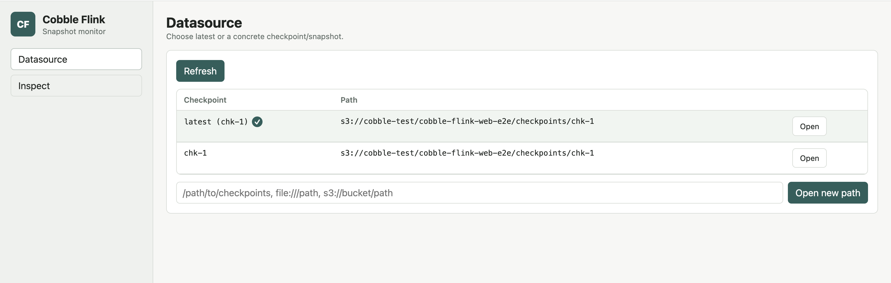
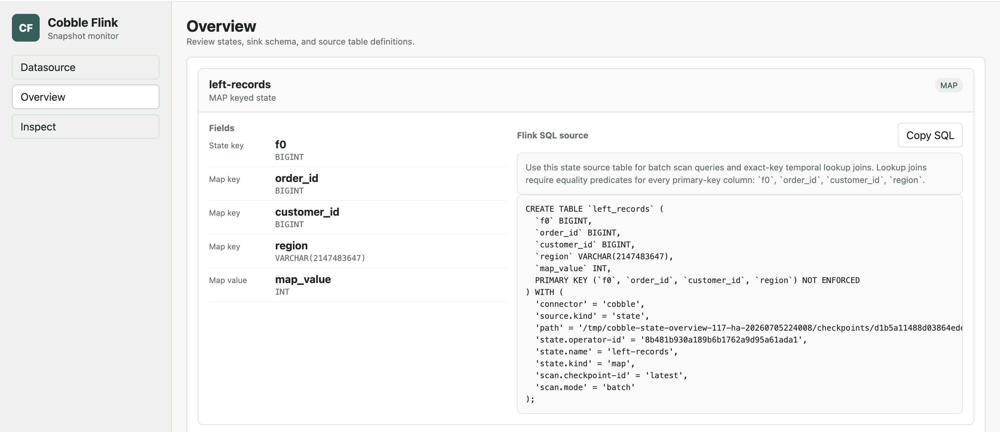

# Web Monitor

Use the Cobble Flink web monitor to inspect Cobble data from a browser. It can
open Flink checkpoint paths written by the Cobble state backend, and it can also
open normal Cobble datasource paths such as sink output.

The monitor is read-only. It runs as a small Java process, serves the UI and API
from the same port, and does not require a Flink job to read the selected
snapshot.

## When To Use It

The web monitor is useful when you want to:

- check which checkpoints or Cobble snapshots are available
- follow `latest` while a job is still producing checkpoints
- keep a small set of rows tracked while newer snapshots appear
- generate Flink SQL source DDL from supported non-timer Cobble state or sink schemas
- inspect Cobble state by state name, verify decoded state keys, MapState keys, ListState values, and timer entries
- inspect Cobble sink rows, primary keys, and value columns

For production reads, use the Cobble source connector or your own application
code. The monitor is meant for debugging, validation, and ad-hoc inspection.

## Build

Build the monitor from the repository:

```bash
./mvnw -pl cobble-flink-monitor -am package -DskipTests
```

The runnable jar is written under `cobble-flink-monitor/target/`.

## Start The Monitor

Start without an initial datasource:

```bash
java -jar cobble-flink-monitor/target/cobble-flink-monitor-*.jar
```

Then open the UI and use the `Datasource` page to enter a checkpoint root,
concrete `chk-*` directory, or Cobble datasource path.

You can also pass an initial path:

```bash
java -jar cobble-flink-monitor/target/cobble-flink-monitor-*.jar \
  --checkpoint file:///path/to/checkpoints-or-cobble-table
```

For Flink checkpoints, both of these are valid:

```bash
java -jar cobble-flink-monitor/target/cobble-flink-monitor-*.jar \
  --checkpoint s3:///path/to/checkpoints

java -jar cobble-flink-monitor/target/cobble-flink-monitor-*.jar \
  --checkpoint s3:///path/to/checkpoints/chk-42
```

Useful options:

```text
--bind 127.0.0.1
--port 8088
--checkpoint file:///path/to/checkpoints-or-cobble-table
--flink-conf /path/to/flink/conf
--storage-options-file /path/to/storage.properties
--storage-option s3.region=us-east-1
--total-buckets 32768
--inspect-default-limit 100
--inspect-max-limit 1000
--user-jar /path/to/job.jar
--user-classpath /path/to/a.jar:/path/to/b.jar
```

## User Jars

Standard POJO, Tuple, and Avro state values usually display their fields
directly without extra jars. If a custom or partially supported serializer
cannot be decoded, the monitor keeps the raw bytes visible and continues
scanning the remaining rows.

Add `--user-jar` when you need to inspect values that depend on classes from
your job. This is commonly needed for custom serializers.

```bash
java -jar cobble-flink-monitor/target/cobble-flink-monitor-*.jar \
  --checkpoint file:///path/to/checkpoints \
  --user-jar /path/to/my-flink-job.jar
```

`--user-jar` is repeatable. It also accepts a directory containing jars. For an
existing classpath string, use `--user-classpath`:

```bash
java -jar cobble-flink-monitor/target/cobble-flink-monitor-*.jar \
  --checkpoint file:///path/to/checkpoints \
  --user-jar /path/to/job.jar \
  --user-jar /path/to/deps/ \
  --user-classpath /path/to/a.jar:/path/to/b.jar
```

A custom serializer may need both the job jar and its dependency jars.

Only load jars from trusted sources. The monitor may load classes from them
while reading state.

## Remote Storage

Set `--checkpoint` to the remote datasource URI. Pass `--flink-conf` when the
cluster already contains the required storage configuration. Additional access
options can be placed in a Java properties file:

```properties
s3.endpoint=http://127.0.0.1:9000
s3.access-key=<access-key>
s3.secret-key=<secret-key>
s3.path.style.access=true
s3.region=us-east-1
```

```bash
java -jar cobble-flink-monitor/target/cobble-flink-monitor-*.jar \
  --flink-conf "$FLINK_HOME/conf" \
  --storage-options-file /path/to/storage.properties \
  --storage-option s3.region=us-east-1 \
  --checkpoint s3://bucket/path/to/table
```

`--storage-option KEY=VALUE` is repeatable, overrides file values, and uses the
last CLI value. These settings apply to the initial path and to datasource paths
opened later in the UI. For another supported filesystem URI, use
`storage.option.<provider-key>`. Explicit file or CLI options take precedence;
when they are omitted, the monitor uses the filesystem configuration loaded by
`--flink-conf`. Keep credentials out of datasource URIs and replace placeholders
through deployment templates or secret management.

## Datasource Page

The `Datasource` page shows the snapshots available under the current path.

For a Flink checkpoint root, the monitor scans `chk-*` directories, discovers
Cobble operators, and lets you choose:

- `latest`, which follows the newest readable checkpoint
- a concrete checkpoint
- an operator, shown on the `Inspect` page for checkpoint datasources

For a normal Cobble datasource, the monitor scans `snapshot/SNAPSHOT-*` and
lets you choose:

- `latest`, which follows the newest Cobble snapshot
- a concrete snapshot

Use `Refresh` to rescan the path. If old checkpoints have been removed, they
are removed from the list on refresh.



## Overview Page

The `Overview` page shows the states or sink schema in the selected datasource.
It generates Flink SQL `CREATE TABLE` DDL for supported non-timer states and
sink schemas.

For checkpoint datasources, each state card shows the decoded key, namespace,
MapState key, and value fields. Generated state DDL uses
`source.kind = 'state'` and includes a `PRIMARY KEY` when the state can be used
as a lookup table. Timer entries are available in [State Inspect](state/), but
do not have SQL source DDL. For sink datasources, the page generates the
matching `source.kind = 'sink'` DDL.

Use `Copy SQL` to copy a table definition into a SQL client or job.



## Inspect Datasources

After selecting a datasource, open `Inspect` and choose the matching guide:

- [State Inspect](state/): inspect schema-aware ValueState, ListState, MapState, ReducingState, AggregatingState, and timer state from a Flink checkpoint.
- [Sink Inspect](sink/): inspect a Cobble sink snapshot by primary key and typed value columns.

Both pages use `Scan` to browse rows and `Track` to keep selected rows visible
while a snapshot changes. The monitor never writes to the datasource.

## API

The monitor exposes these endpoints:

- `GET /healthz`
- `GET /api/v1/meta`
- `GET /api/v1/snapshots`
- `POST /api/v1/mode`
- `GET /api/v1/inspect`

Use the UI for normal inspection. The API is mainly useful for automation or
for debugging the monitor itself.

## Notes

- The monitor never writes to the selected datasource.
- `latest` is resolved from the current datasource list and can be refreshed.
- Checkpoint datasources support operator discovery.
- Schema-aware inspection depends on metadata written with the checkpoint or
  sink snapshot. Older or raw datasources still fall back to bytes.
