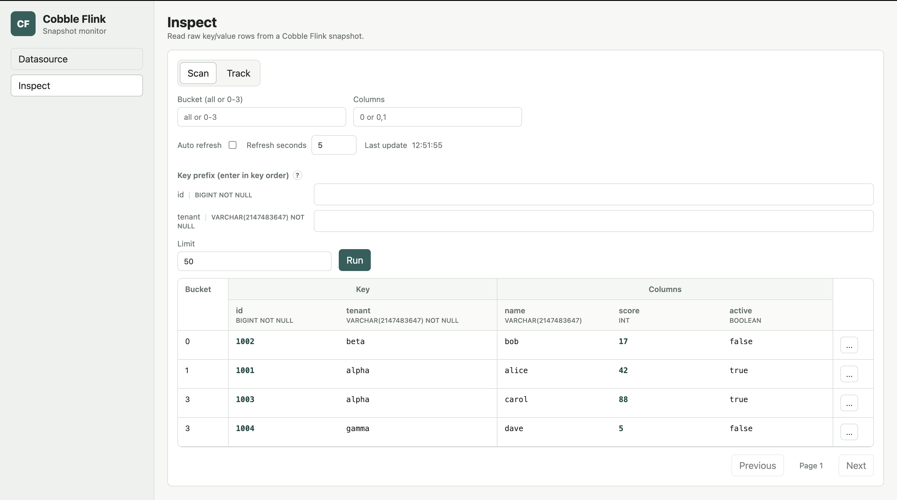

# Sink Inspect

Use sink inspect to browse snapshots written by the Cobble SQL sink. The monitor
opens the sink table root directly, so no checkpoint operator selection is
needed.

## Open A Sink Snapshot

On the `Datasource` page, open the Cobble sink table path and select `latest`
or a concrete snapshot. `latest` follows the newest readable sink snapshot;
choose a concrete snapshot when you need a stable result set.

## Scan By Primary Key

When the sink snapshot contains schema metadata, the `Inspect` page shows each
primary-key field in schema order. Leave every key field empty to scan the
whole snapshot, or fill fields from left to right to narrow the result.

Every key before the last supplied key is an exact match. The last supplied key
is a prefix match. For example, with primary key `(id, tenant)`, entering
`id = 1001` and `tenant = a` finds rows whose tenant starts with `a` for id
`1001`.

You cannot skip a preceding key. If `tenant` is filled while `id` is empty, the
monitor highlights `id` and explains the missing field.

Use `Bucket` to inspect one bucket, `Limit` to control page size, and `Columns`
to request selected value-column indexes such as `0,2`.

## Read Typed Columns

With sink schema metadata, the result table expands primary-key fields and
value columns into separate, named columns. Logical types appear below the
field names, and the table scrolls horizontally when a table has many columns.

The row menu can track a row or copy its raw key and value. `Track` keeps the
same typed presentation and can refresh multiple rows together.

## Older Or Raw Sink Paths

Some existing sink paths may not include inspect schema metadata. The monitor
still opens them and falls back to the raw key, raw columns, and the original
UTF-8 prefix filter. Schema-aware decoding is an enhancement, not a requirement
for reading a sink snapshot.
