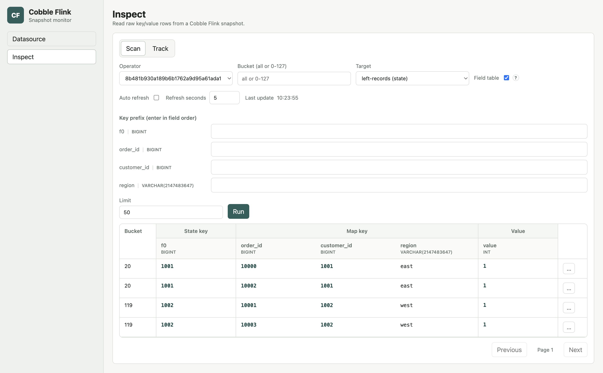

# State Inspect

Use state inspect to validate the contents of a Cobble state backend checkpoint
without restoring or changing the Flink job.

## Open A Checkpoint

On the `Datasource` page, open a checkpoint root or a concrete `chk-*`
directory. Choose `latest` to follow the newest readable checkpoint, or choose
a concrete checkpoint when you need a stable view.

The `Inspect` page then lets you choose the operator and the state name. State
names are shown instead of Cobble column families.

## Scan State

Use `Scan` to browse rows. When schema metadata is available, the monitor shows
the state key and relevant state parts in their decoded form.

For a known serializer, enter a state key in its normal display form. For
example, enter a string directly for a string key, or a decimal number for an
integer key. When a namespace is meaningful, it appears as a separate filter.

## SQL State

When you inspect a checkpoint from a SQL job, leave `Field table` enabled. The
monitor then expands the state key, map key, and value into the columns you use
to reason about the job, instead of asking you to read a serialized byte key.

### Filter By Key Fields

Use `Key prefix` to narrow the rows before you scan. The fields are ordered as
they appear in the stored key: state-key fields first, then namespace and map
key fields when the state has them. Fill them from left to right.

Every field before the last supplied field is an exact match. The last supplied
field is a prefix match, which is useful when you only know the beginning of a
string key. You cannot skip a field: if you type a later field first, the
monitor highlights the missing input and tells you what to enter.

The example below filters a join state by its join key and then shows the state
key, map key, and value as separate table columns.

### Read The Result

The result table keeps the same groups used by the filter. This makes it easy
to compare a key you entered with the rows returned by the checkpoint. The
`Track` tab keeps this field-based presentation while you refresh rows or move
to a newer checkpoint.

For streaming and temporal joins, deduplicate, process-time sort, and many
TopN states, the monitor can usually show the SQL column names. Aggregation,
Over, and window states may show typed columns as `f0`, `f1`, and later ordinal
names instead. This happens when Flink has already discarded the original SQL
aliases; the values and their types remain available.

Interval join cache entries are shown as their nested list and tuple values.
If a state uses a custom serializer or cannot be decoded, the monitor leaves
that row readable as raw bytes and continues scanning the remaining rows.

Disable `Field table` when you need the original serializer-oriented key
filters and raw row presentation. Cobble state inspect currently covers
ValueState, ListState, and MapState; Flink states backed by ReducingState or
AggregatingState are not yet part of this inspect surface.

### ValueState

ValueState shows the decoded state key, namespace when it carries user data,
and the decoded value.

### ListState

ListState shows the decoded state key and list elements. Large lists show the
first 100 elements; use the in-page control to reveal the next 100.

### MapState

MapState shows the state key, map key, and map value separately. Use the state
key to narrow to one keyed state, then optionally provide a map-key prefix to
filter entries inside it. `VoidNamespace` is omitted because it does not carry
user data.

### Timer State

Timer targets always display the timestamp as its own column rather than a
value column. When the job supplies SQL field metadata and **Field table** is
enabled, the timer key and namespace expand into typed fields too. This makes
it possible to see which window and key a pending timer belongs to without
decoding raw bytes by hand.

Use **Key prefix** to narrow the timer list. Enter fields from left to right;
every field before the last must be complete, while the final supplied field
can be a prefix. When metadata is unavailable, the monitor keeps the decoded
timer-key fallback so existing timer inspection continues to work.

## Track Rows

Choose `Track` from a scan row's action menu to retain it in the `Track` tab.
Refresh tracked rows together while you move between snapshots or follow
`latest`.

If a key or value part cannot be decoded, the monitor keeps the encoded bytes
available for inspection instead of failing the whole row.
