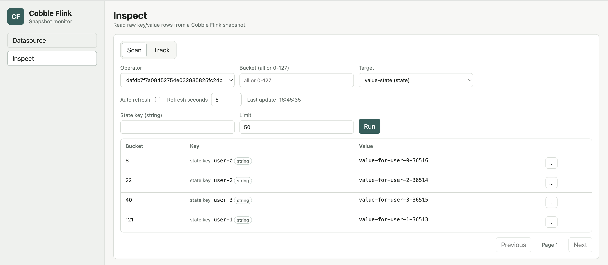
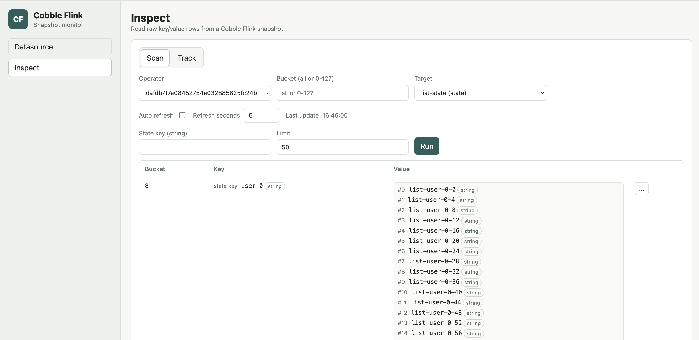
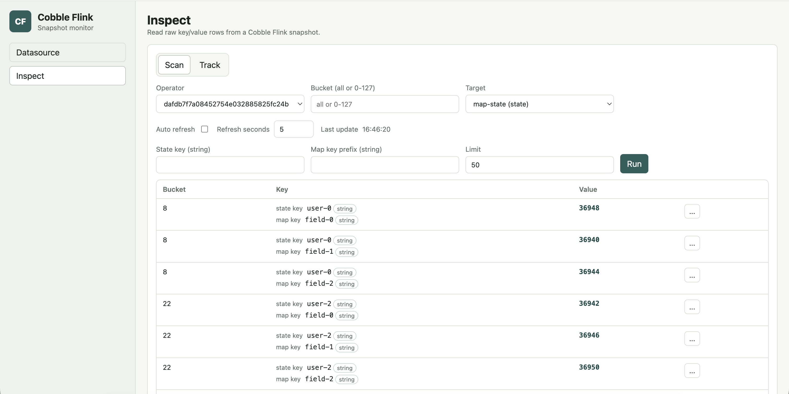
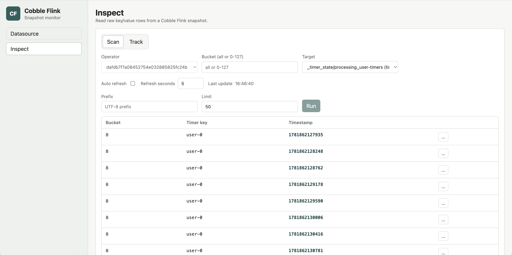

# State Inspect

Use state inspect to validate the contents of a Cobble state backend checkpoint
without restoring or changing the Flink job.

## Open A Checkpoint

On the `Datasource` page, open a checkpoint root or a concrete `chk-*`
directory. Choose `latest` to follow the newest readable checkpoint, or choose
a concrete checkpoint when you need a stable view.

The `Inspect` page then lets you choose the operator and the state name. State
names are shown instead of Cobble column families.

## Scan State

Use `Scan` to browse rows. When schema metadata is available, the monitor shows
the state key and relevant state parts in their decoded form.

For a known serializer, enter a state key in its normal display form. For
example, enter a string directly for a string key, or a decimal number for an
integer key. When a namespace is meaningful, it appears as a separate filter.

### ValueState

ValueState shows the decoded state key, namespace when it carries user data,
and the decoded value.

### ListState

ListState shows the decoded state key and list elements. Large lists show the
first 100 elements; use the in-page control to reveal the next 100.

### MapState

MapState shows the state key, map key, and map value separately. Use the state
key to narrow to one keyed state, then optionally provide a map-key prefix to
filter entries inside it. `VoidNamespace` is omitted because it does not carry
user data.

### Timer State

Timer targets display the timer key and timestamp rather than a value column.
Use the decoded key prefix field to narrow the timer list.

## Track Rows

Choose `Track` from a scan row's action menu to retain it in the `Track` tab.
Refresh tracked rows together while you move between snapshots or follow
`latest`.

If a key or value part cannot be decoded, the monitor keeps the encoded bytes
available for inspection instead of failing the whole row.
